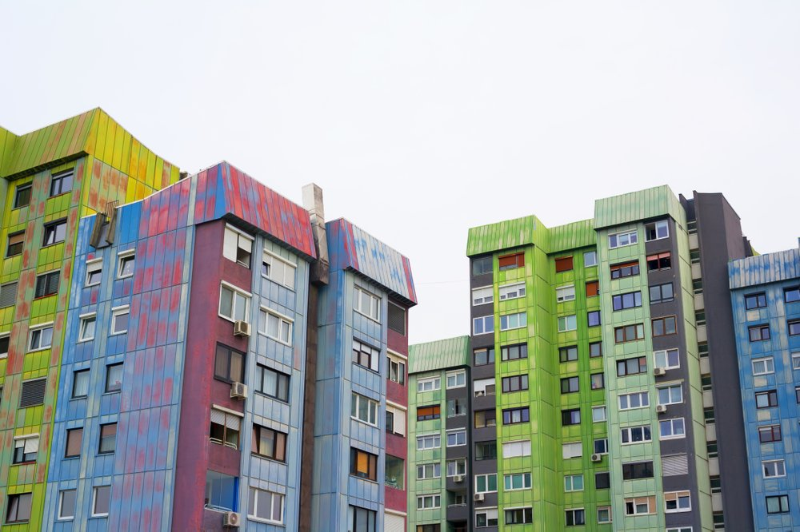

```{r setup, echo=FALSE, results='hide', message=FALSE, warning=FALSE}
knitr::opts_chunk$set(echo=FALSE, message=FALSE, warning=FALSE)

# Uvoz vseh potrebnih knjižnic
source("lib/libraries.r", encoding="UTF-8")
```



## Izbira teme

Odločila sem se analizirati stanovanjsko situacijo v Sloveniji med letoma 2010 in 2020. Zanimalo me bo koliko stanovanjskih objektov se je v tem času v Sloveniji gradilo, kje v Sloveniji se je gradilo največ in kje najmanj. Prav tako me bodo zanimale povezave med indeksi cen življenjskih potrebščin, indeksi cen gradbenih stroškov, indeksi cen stanovanjskih nepremičnin in števila gradenj. Analizirala bom gradnje stanovanj po vrstah stanovanj in povprečne površine po vrstah stanovanj glede na statistično regijo ter povprečne cene kvadratnega metra stanovanjske nepremičnine glede na regijo .

## Obdelava, uvoz in čiščenje podatkov

```{r uvoz}
source("uvoz/uvoz.r", encoding="UTF-8")
```

Podatke sem dobila iz spletnih strani: [Statistični urad Republike Slovenije](https://www.stat.si/statweb), [Geodetska uprava Republike Slovenije](https://www.e-prostor.gov.si/) in [Wikipedia](https://sl.wikipedia.org/wiki/Seznam_ob%C4%8Din_v_Sloveniji). Uvoženi podatki so bili v formatih CSV, XLSX in HTML.

##### Tabela 1 - Število izdanih gradbenih dovoljenj za stanovanjske objekte in ocena dokončanih stanovanj

  - `statistična regija` - spremenljivka: 12 statističnih regij (factor)
  
  - `leto` - spremenljivka: leta od 2010 do 2020 (integer)
  
  - `število prebivalcev` - meritev: podatek o številu prebivalcev (integer)
  
  - `število stanovanj` - meritev: število izdanih gradbenih dovoljenj za stanovanjske objekte (integer)
  
  - `površina stanovanj` - meritev: površina izdanih gradbenih dovoljenj za stanovanjske objekte (double)
  
  - `število ocena dokončanih stanovanj` - meritev: ocenjeno število dokončanih stanovanjskih objektov (integer)
  
  - `površina ocena dokončanih stanovanj` - meritev: ocenjena površina dokončanih stanovanjskih objektov (double)

##### Tabela 2 - Število izdanih gradbenih dovoljenj za stanovanjske objekte in ocena dokončanih stanovanj

  - `statistična regija` - spremenljivka: 12 statističnih regij (factor)
  
  - `leto` - spremenljivka: leta od 2010 do 2020 (integer)
  
  - `vrsta stanovanja` - spremenljivka: vrste stanovanj po številu sob (factor)
  
  - `število prebivalcev` - meritev: podatek o številu prebivalcev (integer)

  - `število ocena dokončanih stanovanj` - meritev: ocenjeno število dokončanih stanovanjskih objektov (integer)
  
  - `površina ocena dokončanih stanovanj` - meritev: ocenjena površina dokončanih stanovanjskih objektov (double)


##### Tabela 3 - Število gradbenih dovoljenj glede na indekse gradbenih stroškov in cen življenjskih potrebščin

  - `leto` - spremenljivka: leta od 2010 do 2020 (integer)
  
  - `indeksi gradbenih stroškov skupaj` - meritev (double)

  - `indeksi stroškov gradbenega materiala` - meritev (double)

  - `indeksi stroškov dela` - meritev (double)

  - `indeksi cen življenskih potrebščin` - meritev (double)

  - `število gradbenih dovoljenj` - meritev (integer)
  
##### Tabela 4 - Indeksi cen glede na stanje stanovanjske nepremičnine in glede na lokacijo
  - `stanje nepremičnin in lokacija` - spremenljivka: stanje stanovanjske nepremičnine in njena lokacija (Ljubljana, Maribor ali preostala Slovenija) (factor)

  - `indeksi cen stanovanjskih nepremičnin` - meritev: indeksi cen (double)

##### Tabela 5 - Število izdanih gradbenih dovoljenj za stanovanjske objekte in ocena dokončanih stanovanj glede na število priseljenih in odseljenih

  - `leto` - spremenljivka: leta od 2010 do 2020 (integer)
  
  - `statistična regija` - spremenljivka: 12 statističnih regij (factor)
  
  - `število priseljenih` - meritev: število priseljenih (integer)
  
  - `število odseljenih` - meritev: število odseljenih (integer)

  - `število stanovanj` - meritev: število izdanih gradbenih dovoljenj za stanovanjske objekte (integer)
  
  - `površina stanovanj` - meritev: površina izdanih gradbenih dovoljenj za stanovanjske objekte (double)
  
  - `število ocena dokončanih stanovanj` - meritev: ocenjeno število dokončanih stanovanjskih objektov (integer)
  
  - `površina ocena dokončanih stanovanj` - meritev: ocenjena površina dokončanih stanovanjskih objektov (double)

##### Tabela 6 - Povprečne cene za m2 stanovanjskega objekta glede na kupoprodajne posle

  - `statistična regija` - spremenljivka: 12 statističnih regij (factor)
  
  - `leto` - spremenljivka: leta 2010, 2015, 2020 (integer)
  
  - `Povprečna cena/m2` - meritev: povprečna cena za m2 glede na sklenjene kupoprodajne posle stanovanjskih nepremičnin (double)
  
  - `Povprečna cena/m2 za nepremičnine mlajše od 10 let` - meritev: povprečna cena za m2 glede na sklenjene posle stanovanjskih objektov mlajših od 10 let (double)

##### Tabela 7 - Kako gospodinjstva preživijo s svojimi prihodki

  - `statistična regija` - spremenljivka: 12 statističnih regij (factor)
  
  - `leto` - spremenljivka: leta od 2010 do 2020 (integer)
  
  - `Stopnja` - spremenljivka: 6 stopenj = zelo težko, težko, z manjšimi težavami, dokaj lahko, lahko, zelo lahko  (factor)
  
  - `Delež ljudi` - meritev: odstotek ljudi (double)


***
## Analiza in vizualizacija podatkov

```{r vizualizacija, results='hide'}
source("vizualizacija/vizualizacija.r", encoding="UTF-8")
```

Analizo sem začela s primerjavo regij, da bi dobila predstavo o tem katere regije so bolj zaželjene oziroma v katerih regijah je kakovost življenja boljša.

```{r graf.kako.gospodinjstva.prezivijo.s.svojimi.prihodki.po.regijah, echo=FALSE, fig.align='center', message=FALSE, paged.print=TRUE, warning=FALSE}
graf.kako.gospodinjstva.prezivijo.s.svojimi.prihodki.po.regijah
```
Zgornji graf prikazuje kako gospodinjstva v posameznih regijah preživijo glede na svoj prihodek. Opazimo, da so med statističnimi regijami kjer prebivalci najlažje preživijo s svojimi prihodki, Gorenjska, Goriška in Osrednjeslovenska, zato lahko za te regije pričakujemo večje povpraševanje po stanovanjskih nepremičninah in posledično višje cene le teh. Prav tako pričakujemo, da se bo v teh regijah gradilo več novih stanovanjskih objektov. Takoj za njimi sledita Obalno-kraška in Jugovzhodna Slovenija.
Regije, kjer je najtežje preživeti s svojimi prihodki, pa so Koroška, Posavska in Pomurska. Pri teh regijah bomo pričakovali manjše povpraševanje in nižje cene stanovanjskih nepremičnin ter manj gradenj.

Spodnja dva grafa, nam kažeta število izdanih gradbenih dovoljenj na 1000 prebivalcev in oceno števila dokončanih stanovanjskih objektov na 1000 prebivalcev po statističnih regijah.

```{r, fig.show="hold", out.width="50%"}

graf.stevilo.izdanih.gradbenih.dovoljenj.na.1000.prebivalcev.po.regijah

graf.ocena.dokoncanih.stanovanj.na.1000.prebivalcev.po.regijah
```

V prvem prikazu, na katerem je primerjava med statističnimi regijami po številu gradbenih dovoljenj za stanovanjske objekte na 1000 prebivalcev, vidimo, da nobena regija ne prevladuje pred ostalimi skozi celotno obdobje.
Iz obeh prikazov je razvidno, da sta Pomurska in Podravska regija od 2016 naprej ves čas zelo visoko.

```{r, fig.show="hold", out.width="50%"}
graf.indeksi
graf.gradbena.dovoljenja
```

Zgornji graf na levi strani prikazuje gibanje indeksov cen življenjskih potrebščin in indeksov gradbenih stroškov, medtem ko drugi graf prikazuje število izdanih gradbenih dovoljenj za stanovanjske objekte.

Iz prvega grafa, ki primerja različne indekse, vidimo, da indeks stroškov materiala sledi indeksu cen življenjskih potrebščin. Indeks stroškov dela pa nasprotno, v letih 2011 do 2014 pada, medtem ko indeks cen življenjskih potrebščin raste. Takrat je strmo padlo tudi število izdanih gradbenih dovoljenj, kar lahko pripišemo posledicam finančne krize iz leta 2008.

Od leta 2016 pa vse do 2020 vsi indeksi naraščajo, še posebej strmo narašča indeks stroškov dela. Vzrok za tako povečanje indeksa stroškov dela, poleg povečanja indeksa cen življenjskih potrebščin, je tudi to, da je veliko poklicev iz gradbeništva na seznamu deficitarnih poklicev. V tem času se povečuje tudi število izdanih gradbenih dovoljenj, vendar še ni doseglo števila iz leta 2010.

```{r, fig.show="hold", out.width="50%"}
graf.nove.stare.indeks
graf.nova.stanovanja.in.hise.indeks
graf.rabljena.stanovanja.in.hise.indeks
graf.rabljena.stanovanja.v.lj.in.preostali.slo.indeks
```

Na zgornjih grafih so prikazani različni indeksi cen stanovanjskih nepremičnin. Vsi grafi imajo podobno obliko kot graf indeksov gradbenih stroškov.
```{r , echo=FALSE, fig.align='center', message=FALSE, paged.print=TRUE, warning=FALSE}
graf.stevilo.gradbenih.dovoljenj.po.vrstah
```

Na zgornjem prikazu vidimo, kakšni stanovanjski objekti se gradijo po različnih statističnih regijah (podatki so za celotno časovno obdobje: od 2010 do 2020). Posebej izstopa Obalno-kraška, tam se izmed vseh drugih vrst, gradi največ enosobnih stanovanj. Po številu enosobnih stanovanj glede na število prebivalcev Obalno-kraški regiji sledi Goriška. Pri številu pet ali večsobnih stanovanj oziroma hiš pa sta glede na število prebivalcev v ospredju Podravska in Primorsko-notranjska regija.

Na spodnjem grafu je prikazano, kakšna je povprečna površina stanovanjskih objektov glede na vrsto po regijah. Tukaj vidimo, da so v prej izpostavljeni Obalno-kraški statistični regiji, enosobna stanovanja pod povprečjem glede na površino. Medtem ko so v sosednji regiji Goriški, enosobna stanovanja v povprečju večja. V povprečju največja enosobna stanovanja imata Gorenjska in Primorsko-notranjska, vendar je število enosobnih stanovanj glede na število prebivalcev majhno.

Če pogledamo še pet ali večsobna stanovanja oziroma hiše, vidimo, da imata regiji, kjer se jih največ gradi (glede na število prebivalcev), v povprečju povprečno površino glede na ostale regije. Pri tej vrsti stanovanj vidimo, da je površina povprečno najmanjša v Posavski regiji, sledi ji Pomurska.

```{r , echo=FALSE, fig.align='center', message=FALSE, paged.print=TRUE, warning=FALSE}
graf.povprecna.povrsina.stanovanj.po.vrstah
```

Poglejmo si sedaj še po kakšnih cenah so se prodajale stanovanjske nepremičnine po statističnih regijah v letu 2010 in 2020. Na spodnjem zemljevidu so prikazane povprečne cene za kvadratni meter.
V obeh letih izstopata Obalno-kraška in Osrednjeslovenska regija. V letu 2010 je večina ostalih regij enakovrednih, medtem ko v letu 2020 Pomurska, Gorenjska, Primorsko-notranjska in Podravska sledijo Osrednjeslovenski ter Obalnokraški regiji.

```{r, fig.show="hold", out.width="50%"}

zemljevid.povprecna.cena.na.kvadratni.meter.2010
zemljevid.povprecna.cena.na.kvadratni.meter.2020
```

***

## Napredna analiza podatkov
V tem delu analize se bom osredotočila na število gradbenih dovoljenj v odvisnosti od različnih parametrov. Zanimala me bo povezava med številom dovoljenj in indeksom stroškov ter vpliv selitev med regijami na število izdanih gradbenih dovoljenj.
Prav tako bom razvrstila statistične regije v skupine glede na število gradenj in oceno končanih stanovanjskih objektov. Na koncu bom za Osrednjeslovensko regijo še napovedala število gradenj v prihodnje.

```{r analiza}
source("analiza/analiza.r", encoding="UTF-8")
```

Pri isaknju povezave med številom izdanih gradbenih dovoljenj in razliko med priseljenimi in odseljenimi nisem našla nobene smiselne povezave, zato sem s pomočjo linearne regresije narisala spodnji graf, ki prikazuje povezavo med številom izdanih gradbenih dovoljenj za stanovanjske objekte in indeksom gradbenih stroškov.
Na grafu vidimo, da je število izdanih gradbenih dovoljenj zelo visoko takrat, ko je indeks najnižji. Z naraščanjem indeksa število strmo pade, vendar le do določenega števila. Potem se spet malo dvigne in naprej ostaja konstantno.

```{r analiziran.graf, echo=FALSE, fig.align='center', message=FALSE, paged.print=TRUE, warning=FALSE}
analiziran.graf
```


Pri razvrščanju v skupine opazimo (prikaz spodaj), da se največ gradi v Osrednjeslovenski in Podravski regiji, naslednja skupina regij po številu gradenj sta Savinjska in Gorenjska, tretja skupina so Jugovzhodna Slovenija, Pomurska in Obalno-kraška, četrta Posavska ter Primorsko-notranjska, v zadnji skupini pa se nahaja Posavska regija, torej je tam število gradenj najmnajše.

```{r diagram5, echo=FALSE, fig.align='center', message=FALSE, paged.print=TRUE, warning=FALSE}
diagram5
```

Preko napovednega modela sem narisala graf napovedi števila gradenj za naslednja 3 leta (2020, 2021, 2022) v Osrednjeslovenski regiji. Sestavila sem tri različne modele, ki pa so si dokaj enotni. Glede na te modele, bo število gradenj stanovanjskih objektov ostalo konstantno.

```{r graf.napovedovanje, echo=FALSE, fig.align='center', message=FALSE, paged.print=TRUE, warning=FALSE}
graf.napovedovanje
```
Za konec sem naredila še Shiny aplikacijo. Tukaj lahko vidimo koliko gradbenih dovoljenj je bilo izdanih v določenem letu in za točno določeno vrsto stanovanjskega objekta po posameznih statističnih regijah.

```{r shiny}
shinyAppDir("shiny", options=list(width="100%", height=600))
```

## Sklep

V Sloveniji se največ gradi v Osrednjeslovenski regiji, sledi ji Podravska. Število gradenj je v 2020 upadlo, če primerjamo z letom 2010, saj so gradbeni stroški, predvsem stroški dela, narasli. Indeksi cen stanovanjskih nepremičnin so v letu 2020 zelo visoki, najvišji v Ljubljanski občini.
Število gradenj v Osrednjeslovenski regiji po napovednem modelu naj ne bi naraslo, ampak naj bi otalo konstantno, torej indeksi cen stanovanjskih nepremičnin, še ne bodo padli.
